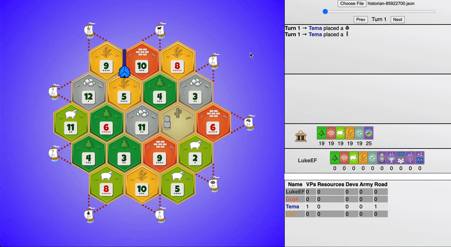

# Historian - Game Recorder for Colonist.io

Historian is a fan-made browser extension and web app which allow for easy capture and replay of Colonist.io games.

## Installation

The Chrome extension is availalble [here](https://chromewebstore.google.com/detail/colony-historian/olhlbckekdlekoaifaoboooalbeboefj). Chrome is currently the only browser supported for this extension. Contributions to assist with porting the extension to other browsers are welcome!

## Usage

The extension will automatically download your Colonist.io games after it is installed. The extension will only work if it is active during the initial connection to Colonist.io and if a new game is started, so make sure to refresh and start a new game to start saving logs. The files will be saved as `historian-<game-id>.json` in your default downloads location upon completion of a game. If your connection is broken or refreshed during the game, the replay will not be saved.

To replay a game, simply navigate to https://lemeryfertitta.github.io/ColonyHistorian/ or open the `index.html` file in your browser and upload the file you'd like to replay.

## Bug Reports and Feature Requests

Please use the [Github issue tracker](https://github.com/lemeryfertitta/ColonyHistorian/issues) to submit a bug report or feature request.
